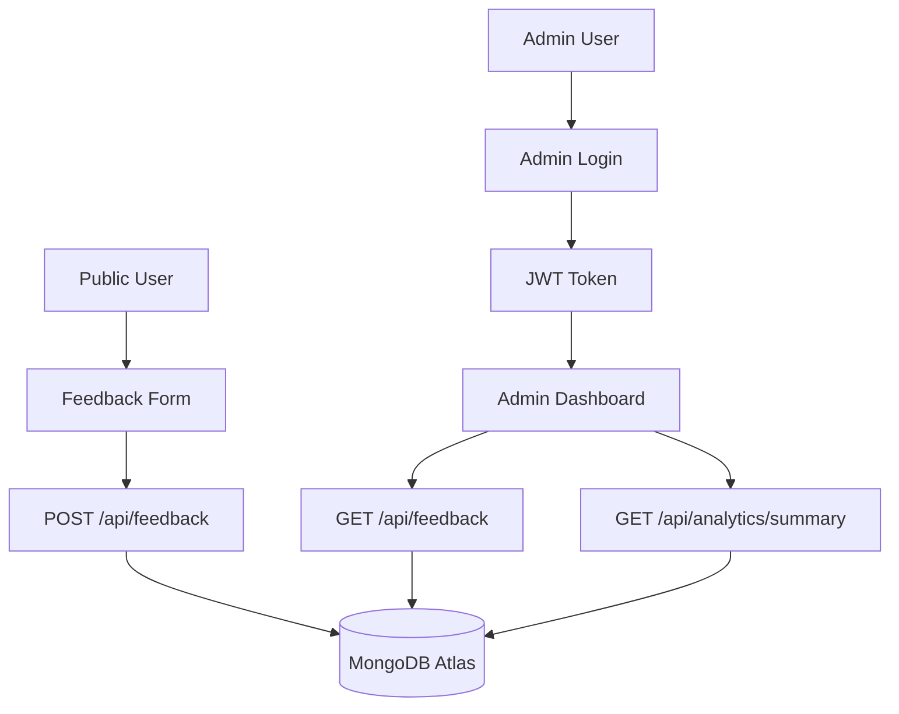
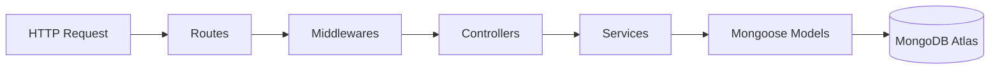
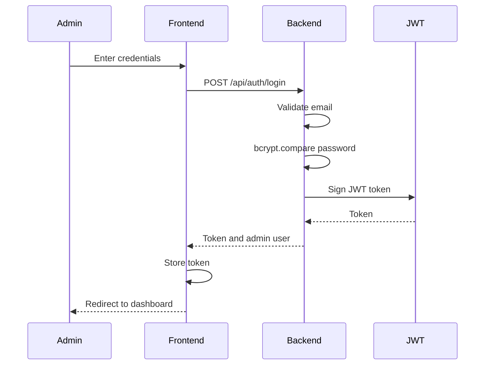
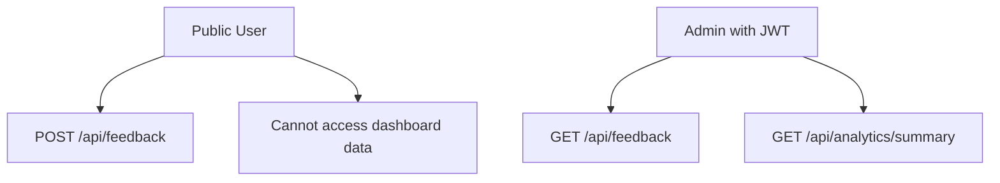
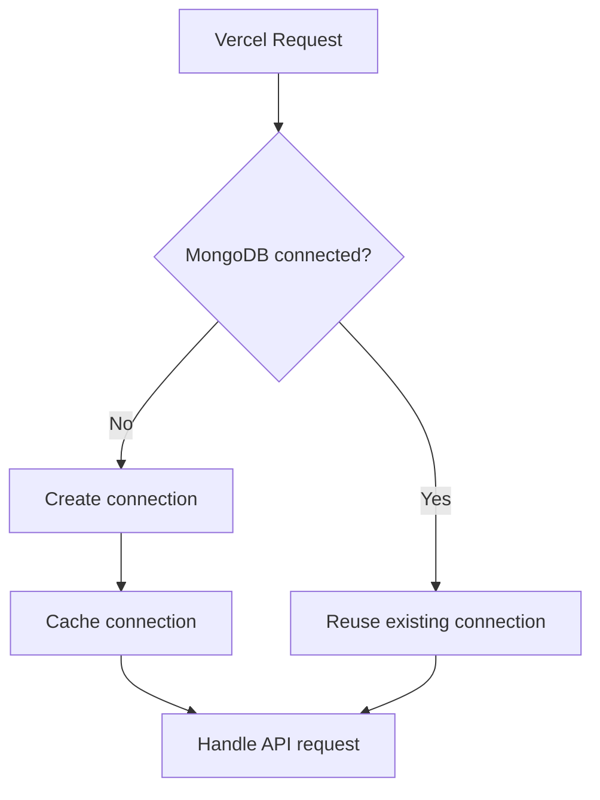

# DECISIONS.md

This document explains the technical decisions, tradeoffs, and reasoning behind the Customer Feedback Platform.

---

## 1. Product Understanding

The assignment required a platform where:

1. Public users can submit feedback.
2. Admin users can view feedback and analytics.

The product was designed around two separate flows:



This separation ensures users can submit feedback easily, while admin data remains protected.

---

## 2. Architecture Decision

I used a MERN-style architecture:

```txt
React Frontend → Express Backend → MongoDB Atlas
```

### Why this architecture?

| Layer         | Reason                                      |
| ------------- | ------------------------------------------- |
| React         | Good for interactive UI and dashboard       |
| Express       | Lightweight and fast REST API framework     |
| MongoDB       | Flexible document storage for feedback data |
| Mongoose      | Schema validation and clean DB operations   |
| Vercel        | Simple deployment for frontend and backend  |
| MongoDB Atlas | Managed cloud database                      |

This stack is practical for a machine test because it shows full-stack thinking, API design, database modeling, deployment, and security.

---

## 3. Frontend Architecture

The frontend is split by responsibility.

```txt
src
├── app
├── components
├── constants
├── pages
├── services
└── utils
```

### Key decisions

| Decision                        | Reason                                                |
| ------------------------------- | ----------------------------------------------------- |
| Pages separated from components | Keeps screen-level logic clean                        |
| Common components               | Reusable Button and error components                  |
| Service layer                   | Keeps API calls outside UI components                 |
| React Hook Form + Zod           | Better validation and form state management           |
| React Router                    | Supports public and admin routes                      |
| Vercel rewrite config           | Fixes direct access to SPA routes like `/admin/login` |

---

## 4. Backend Architecture

The backend follows a layered structure:

```txt
Route → Middleware → Controller → Service → Model → Database
```



### Why this structure?

| Layer       | Responsibility                   |
| ----------- | -------------------------------- |
| Routes      | API endpoint definitions         |
| Middleware  | Auth, rate limiting, errors      |
| Controllers | Request and response handling    |
| Services    | Business logic and DB operations |
| Models      | MongoDB schema                   |
| Config      | DB, env, Swagger setup           |

This makes the backend easier to maintain and extend.

---

## 5. Database Decision

MongoDB Atlas was selected as the database.

### Why MongoDB?

Feedback data is document-like and flexible. A feedback record contains:

```js
{
  category: "Support",
  comment: "Need better instructions after submitting feedback.",
  rating: 2,
  status: "New",
  source: "Web",
  user: {
    name: "Akshay Chavan",
    email: "akshay@example.com"
  },
  metadata: {
    browser: "...",
    device: "Web",
    ipAddress: "..."
  },
  createdAt: "...",
  updatedAt: "..."
}
```

This fits naturally into a MongoDB document.

---

## 6. Authentication Decision

Admin authentication uses:

* Admin email from environment variable
* bcrypt hashed password
* JWT token
* Auth middleware

### Login flow



### Why JWT?

JWT is simple and suitable for this assignment because:

* It works well with React SPAs.
* It keeps backend stateless.
* It can be sent through the `Authorization` header.
* It is easy to protect admin APIs.

### Tradeoff

JWT logout cannot truly invalidate a token unless a token blacklist or session store is used. For this project, logout clears the token from frontend storage and calls a backend logout endpoint.

For production, I would improve this with:

* HttpOnly cookies
* Refresh tokens
* Short-lived access tokens
* Token blacklist

---

## 7. Public vs Protected Routes

Public routes:

```txt
GET  /api/health
POST /api/auth/login
POST /api/feedback
```

Protected routes:

```txt
POST /api/auth/logout
GET  /api/feedback
GET  /api/analytics/summary
```

### Why?

Public users should submit feedback without login.
Admin-only data like feedback list and analytics must be protected.



---

## 8. Validation Decision

Validation is done in both frontend and backend.

| Layer    | Validation                       |
| -------- | -------------------------------- |
| Frontend | React Hook Form + Zod            |
| Backend  | Validator file + Mongoose schema |

### Why both?

Frontend validation improves user experience.
Backend validation protects the API even if someone bypasses the frontend.

---

## 9. Rate Limiting Decision

Rate limiting was added to:

```txt
POST /api/auth/login
POST /api/feedback
```

### Reason

These are the most abuse-prone endpoints.

| Endpoint            | Risk                 |
| ------------------- | -------------------- |
| Login               | Brute force attempts |
| Feedback submission | Spam feedback        |

Rate limiting improves production readiness.

---

## 10. Swagger Decision

Swagger documentation is available at:

```txt
https://customer-feedback-platform-backend.vercel.app/api/docs
```

Swagger was added because it helps reviewers:

* See all endpoints.
* Test requests quickly.
* Understand request bodies.
* Understand protected routes.
* Use JWT authorization from the docs.

### Vercel-specific decision

`swagger-ui-express` static assets did not work reliably with Vercel serverless routing.
To fix this, Swagger JSON is served separately at:

```txt
/api/docs.json
```

and the Swagger UI page loads Swagger assets from CDN.

This made Swagger reliable in production.

---

## 11. Serverless Backend Decision

The backend is deployed on Vercel as a serverless Express API.

### Challenge

Vercel serverless functions do not run like a traditional long-running server.
The local backend starts from:

```txt
src/server.js
```

But Vercel uses:

```txt
api/index.js
```

### Solution

A serverless handler was added:

```txt
backend/api/index.js
```

It imports the Express app and ensures MongoDB connects before handling the request.

---

## 12. MongoDB Connection Decision for Vercel

MongoDB connection caching was added for serverless stability.

### Why?

Without caching, every serverless invocation may try to create a new MongoDB connection.
This can cause slow responses or timeout errors.

### Solution

The backend uses cached connection variables:

```txt
cachedConnection
cachedConnectionPromise
```

This prevents unnecessary repeated connection attempts.



---

## 13. CORS Decision

Backend CORS allows the deployed frontend URL:

```txt
https://customer-feedback-platform-frontend.vercel.app
```

Local development ports are also allowed:

```txt
http://localhost:5173
http://localhost:5174
http://localhost:5175
```

This supports both development and production.

---

## 14. Frontend Routing Decision

React Router handles routes like:

```txt
/
/admin/login
/admin/dashboard
```

On Vercel, direct access to `/admin/login` can return 404 unless a rewrite is configured.

So this file was added:

```txt
frontend/vercel.json
```

```json
{
  "rewrites": [
    {
      "source": "/(.*)",
      "destination": "/index.html"
    }
  ]
}
```

This ensures all frontend routes serve the React app.

---

## 15. Dashboard API Decision

The dashboard uses two APIs:

```txt
GET /api/analytics/summary
GET /api/feedback
```

### Why separate APIs?

Analytics and feedback list have different purposes.

| Endpoint             | Purpose                    |
| -------------------- | -------------------------- |
| `/analytics/summary` | Aggregated dashboard stats |
| `/feedback`          | Detailed feedback list     |

This keeps responses focused and easier to maintain.

---

## 16. Tradeoffs

### Single Admin via Environment Variables

A full admin-user database was not created.
Instead, admin credentials are managed through environment variables.

Reason:

* Simpler for assignment scope.
* Secure enough with bcrypt hash.
* Avoids unnecessary user-management complexity.

Future improvement:

* Add `AdminUser` model.
* Add role-based access control.

---

### JWT in Frontend Storage

The JWT is stored on the frontend for API calls.

Reason:

* Simple implementation.
* Easy to test.
* Suitable for this assignment.

Future improvement:

* Use HttpOnly secure cookies.
* Add refresh token flow.

---

### Vercel Backend Instead of Render

Backend was deployed on Vercel to keep both frontend and backend on the same platform.

Challenge:

* MongoDB connection needed serverless optimization.
* Swagger UI needed CDN-based assets.
* SPA routes needed frontend rewrites.

These issues were solved while keeping deployment simple.

---

## 17. AI Tools Used

I used ChatGPT Plus for:

* Requirement analysis
* Architecture planning
* Implementation guidance
* Debugging support
* Deployment debugging
* Documentation drafting

I used Codex for:

* Code generation assistance
* Refactoring suggestions
* Faster boilerplate creation

All AI-generated suggestions were reviewed, tested, modified, and validated before being included in the final project.

---

## 18. What I Would Do With One More Week

If I had one more week, I would add:

* Unit tests for validators and services.
* React component tests.
* GitHub Actions CI/CD.
* Admin user model.
* Role-based access control.
* CSV export from dashboard.
* Email notification on new feedback.
* Better pagination UI.
* Time-series analytics.
* Docker setup.
* More advanced monitoring and observability.

---

## 19. Most Difficult Challenge

The most difficult challenge was making a traditional Express backend behave reliably on Vercel serverless functions.

Locally, the backend can connect to MongoDB once when `src/server.js` starts. In production, Vercel can create fresh function instances, so connecting on every request risks slow responses, connection spikes, and timeouts. The fix was to create a dedicated serverless entrypoint in `backend/api/index.js` and cache both the active MongoDB connection and any in-progress connection promise.

Swagger also needed production-specific work. `swagger-ui-express` worked locally, but static UI assets were not reliable in the serverless deployment. Serving `/api/docs.json` separately and loading Swagger UI from a CDN made the docs work consistently.

---

## 20. One Place AI Helped

AI helped most during deployment debugging. It helped identify that the local Express entrypoint and the Vercel serverless entrypoint needed to be different, and it suggested checking MongoDB connection reuse instead of treating the dashboard timeout as only a frontend problem.

I still validated the suggestions manually by reading the code paths, checking environment variables, testing the deployed URLs, and adjusting the implementation to match this project.

---

## 21. One Place I Disagreed With AI

One suggestion was to add a full admin-user model and registration flow. I disagreed because it would increase scope without improving the core assignment outcome.

For this version, a single admin configured through environment variables is a better tradeoff. It keeps the system secure enough for the machine test, avoids unnecessary user-management complexity, and leaves a clear upgrade path for role-based access control later.

---

## 22. What Breaks First At 100k Users

The first pressure point would likely be the dashboard feedback list and analytics aggregation.

At small scale, fetching recent feedback and calculating category or rating summaries directly from MongoDB is acceptable. At 100,000 users, the system would need stronger indexes, pagination limits, cached analytics, background aggregation jobs, and possibly separate read models for dashboard charts.

The public feedback endpoint would also need stronger abuse protection: stricter rate limits, spam detection, request fingerprinting, and observability around failed submissions.

---

## 23. What I Would Improve, Change, Or Challenge

I would improve the assignment by asking candidates to include one operational scenario, such as: "Your dashboard times out in production but works locally. How do you debug it?"

That would test production thinking more directly than adding more UI requirements. It would also reveal whether the candidate understands deployment logs, database connections, environment variables, API contracts, and frontend error handling.

---

## 24. Final Decision Summary

| Area          | Decision                         |
| ------------- | -------------------------------- |
| Frontend      | React + Vite                     |
| Styling       | Tailwind CSS                     |
| Forms         | React Hook Form + Zod            |
| Backend       | Express.js                       |
| Database      | MongoDB Atlas                    |
| ODM           | Mongoose                         |
| Auth          | JWT + bcrypt                     |
| Docs          | Swagger                          |
| Deployment    | Vercel frontend + Vercel backend |
| Security      | Helmet, CORS, rate limiting      |
| Serverless DB | Cached MongoDB connection        |
