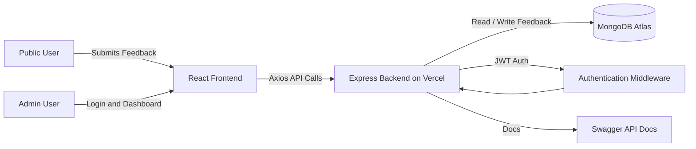
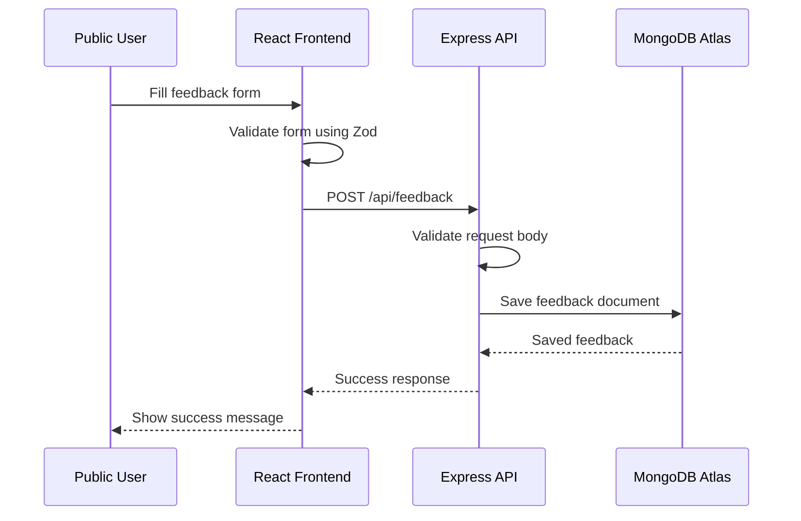
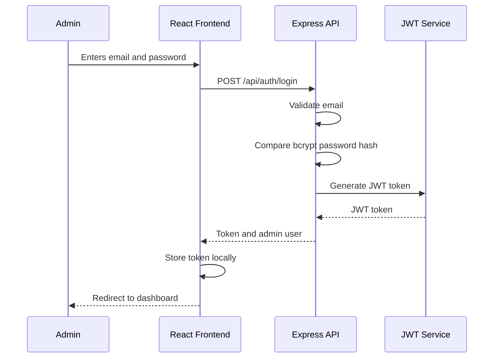
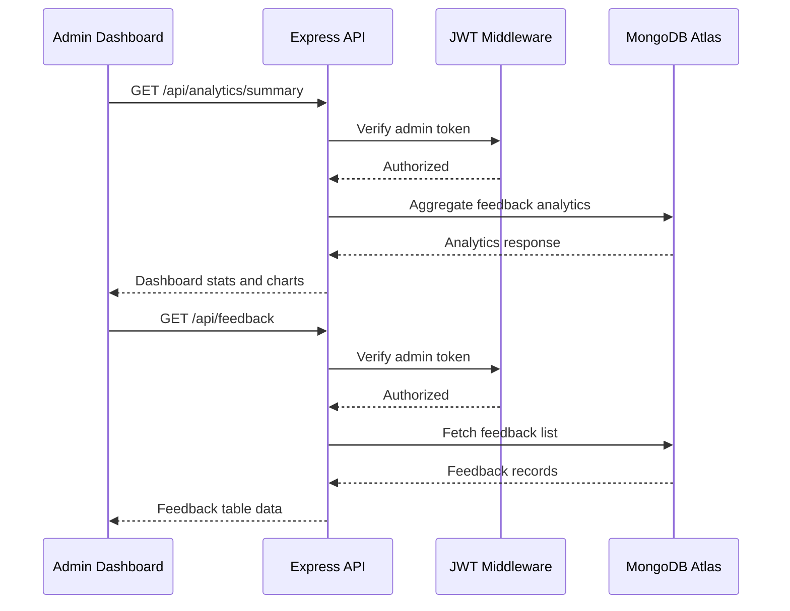

# Customer Feedback Platform

A full-stack Customer Feedback Platform built for the Acowale CRM machine test.

The application allows public users to submit feedback and allows an authenticated admin to view feedback analytics, search/filter submissions, and monitor customer sentiment through a dashboard.

---

## Live Links

| Service           | URL                                                                 |
| ----------------- | ------------------------------------------------------------------- |
| Frontend          | https://customer-feedback-platform-frontend.vercel.app              |
| Backend API       | https://customer-feedback-platform-backend.vercel.app               |
| Health Check      | https://customer-feedback-platform-backend.vercel.app/api/health    |
| Swagger API Docs  | https://customer-feedback-platform-backend.vercel.app/api/docs      |
| Swagger JSON      | https://customer-feedback-platform-backend.vercel.app/api/docs.json |
| GitHub Repository | https://github.com/akshaychavan23031998/customer-feedback-platform  |

---

## Demo Admin Credentials

```txt
Email: admin@acowale.test
Password: password123
```

The admin password is not stored as plain text. It is stored as a bcrypt hash through backend environment variables.

---

## Tech Stack

### Frontend

| Technology       | Purpose               |
| ---------------- | --------------------- |
| React.js         | UI development        |
| Vite             | Frontend build tool   |
| Tailwind CSS     | Styling               |
| React Router DOM | Client-side routing   |
| React Hook Form  | Form state management |
| Zod              | Form validation       |
| Axios            | API communication     |
| Recharts         | Dashboard charts      |
| Lucide React     | Icons                 |

### Backend

| Technology         | Purpose                       |
| ------------------ | ----------------------------- |
| Node.js            | JavaScript runtime            |
| Express.js         | REST API framework            |
| MongoDB Atlas      | Cloud database                |
| Mongoose           | ODM for MongoDB               |
| JWT                | Admin authentication          |
| bcryptjs           | Password hashing              |
| Helmet             | Security headers              |
| CORS               | Cross-origin request handling |
| Morgan             | Request logging               |
| express-rate-limit | Rate limiting                 |
| Swagger            | API documentation             |

### Deployment

| Layer    | Platform      |
| -------- | ------------- |
| Frontend | Vercel        |
| Backend  | Vercel        |
| Database | MongoDB Atlas |

---

## Features

### Public User Features

* Public feedback submission without login.
* Category selection.
* Rating from 1 to 5.
* Detailed comment field.
* Optional name and email.
* Frontend validation using React Hook Form and Zod.
* Backend validation before saving feedback.
* Feedback stored permanently in MongoDB Atlas.
* Rate limiting to reduce spam submissions.

### Admin Features

* Admin login using backend authentication.
* JWT-based protected dashboard.
* Protected backend admin APIs.
* Dashboard summary cards:

  * Total feedback
  * New feedback
  * In review feedback
  * Resolved feedback
  * Archived feedback
  * Average rating
* Category distribution chart.
* Rating distribution chart.
* Recent submissions section.
* Feedback explorer table.
* Search, filter, and sort support.
* Logout flow.

### Backend Features

* RESTful API structure.
* MongoDB Atlas integration.
* Mongoose data model.
* Health check endpoint.
* Swagger API documentation.
* Centralized error handling.
* 404 middleware.
* Environment-based configuration.
* JWT middleware for protected routes.
* Rate limiting for login and feedback submission.
* Production deployment on Vercel.
* Serverless MongoDB connection caching.

---

## Application Architecture



---

## Public Feedback Flow



---

## Admin Authentication Flow



---

## Admin Dashboard Data Flow



---

## Folder Structure

```txt
customer-feedback-platform
├── backend
│   ├── api
│   │   └── index.js
│   ├── src
│   │   ├── config
│   │   │   ├── db.js
│   │   │   ├── env.js
│   │   │   └── swagger.js
│   │   ├── controllers
│   │   │   ├── analytics.controller.js
│   │   │   ├── auth.controller.js
│   │   │   ├── feedback.controller.js
│   │   │   └── health.controller.js
│   │   ├── data
│   │   │   └── feedback.store.js
│   │   ├── middlewares
│   │   │   ├── auth.middleware.js
│   │   │   ├── error.middleware.js
│   │   │   ├── notFound.middleware.js
│   │   │   └── rateLimit.middleware.js
│   │   ├── models
│   │   │   └── Feedback.js
│   │   ├── routes
│   │   │   ├── analytics.routes.js
│   │   │   ├── auth.routes.js
│   │   │   ├── feedback.routes.js
│   │   │   └── health.routes.js
│   │   ├── services
│   │   │   └── feedback.service.js
│   │   ├── utils
│   │   │   └── jwt.js
│   │   ├── validators
│   │   │   └── feedback.validator.js
│   │   ├── app.js
│   │   └── server.js
│   ├── .env.example
│   ├── package.json
│   └── vercel.json
│
├── frontend
│   ├── src
│   │   ├── app
│   │   │   └── routes
│   │   ├── components
│   │   │   ├── auth
│   │   │   ├── common
│   │   │   ├── dashboard
│   │   │   └── feedback
│   │   ├── constants
│   │   ├── pages
│   │   │   ├── admin
│   │   │   └── public
│   │   ├── services
│   │   ├── utils
│   │   ├── App.jsx
│   │   └── main.jsx
│   ├── .env.example
│   ├── package.json
│   └── vercel.json
│
├── README.md
├── DECISIONS.md
└── TEACH_US.md
```

---

## API Endpoints

Swagger documentation is available at:

```txt
https://customer-feedback-platform-backend.vercel.app/api/docs
```

### Health

| Method | Endpoint      | Auth Required | Description      |
| ------ | ------------- | ------------: | ---------------- |
| GET    | `/api/health` |            No | Check API health |

### Auth

| Method | Endpoint           | Auth Required | Description  |
| ------ | ------------------ | ------------: | ------------ |
| POST   | `/api/auth/login`  |            No | Admin login  |
| POST   | `/api/auth/logout` |           Yes | Admin logout |

### Feedback

| Method | Endpoint        | Auth Required | Description                           |
| ------ | --------------- | ------------: | ------------------------------------- |
| POST   | `/api/feedback` |            No | Submit public feedback                |
| GET    | `/api/feedback` |           Yes | Get feedback list for admin dashboard |

### Analytics

| Method | Endpoint                 | Auth Required | Description                     |
| ------ | ------------------------ | ------------: | ------------------------------- |
| GET    | `/api/analytics/summary` |           Yes | Get dashboard analytics summary |

---

## Environment Variables

### Backend `.env`

```env
NODE_ENV=development
PORT=5000
CLIENT_URL=http://localhost:5173
API_PUBLIC_URL=http://localhost:5000
MONGODB_URI=mongodb+srv://<username>:<password>@<cluster-host>/customer-feedback-platform?appName=customer-feedback-platform

JWT_SECRET=replace-with-secure-jwt-secret
JWT_EXPIRES_IN=1d
ADMIN_EMAIL=admin@acowale.test
ADMIN_PASSWORD_HASH=replace-with-bcrypt-password-hash
```

### Frontend `.env`

```env
VITE_API_BASE_URL=http://localhost:5000/api
```

---

## Local Setup

### 1. Clone Repository

```bash
git clone https://github.com/akshaychavan23031998/customer-feedback-platform.git
cd customer-feedback-platform
```

---

### 2. Backend Setup

```bash
cd backend
npm install
```

Create `backend/.env` using `backend/.env.example`.

Run backend:

```bash
npm run dev
```

Backend local URL:

```txt
http://localhost:5000
```

Health check:

```txt
http://localhost:5000/api/health
```

Swagger docs:

```txt
http://localhost:5000/api/docs
```

---

### 3. Frontend Setup

Open another terminal:

```bash
cd frontend
npm install
```

Create `frontend/.env` using `frontend/.env.example`.

Run frontend:

```bash
npm run dev
```

Frontend local URL:

```txt
http://localhost:5173
```

If port 5173 is busy, Vite may use 5174 or 5175.

---

## Build and Lint

### Frontend

```bash
cd frontend
npm run build
npm run lint
```

### Backend

```bash
cd backend
npm run dev
```

---

## Security Measures

| Area             | Implementation                       |
| ---------------- | ------------------------------------ |
| Password storage | bcrypt hash                          |
| Authentication   | JWT                                  |
| Protected routes | Backend auth middleware              |
| Public routes    | Feedback submission and health check |
| Rate limiting    | Login and feedback submission        |
| Security headers | Helmet                               |
| CORS             | Controlled frontend origin           |
| Secrets          | Environment variables                |
| Validation       | Frontend and backend validation      |
| Error handling   | Centralized error middleware         |

---

## Production Deployment

### Backend on Vercel

Backend root directory:

```txt
backend
```

Backend environment variables:

```env
NODE_ENV=production
PORT=5000
CLIENT_URL=https://customer-feedback-platform-frontend.vercel.app
API_PUBLIC_URL=https://customer-feedback-platform-backend.vercel.app
MONGODB_URI=<mongodb-atlas-uri>
JWT_SECRET=<secure-production-secret>
JWT_EXPIRES_IN=1d
ADMIN_EMAIL=admin@acowale.test
ADMIN_PASSWORD_HASH=<bcrypt-password-hash>
```

### Frontend on Vercel

Frontend root directory:

```txt
frontend
```

Frontend environment variable:

```env
VITE_API_BASE_URL=https://customer-feedback-platform-backend.vercel.app/api
```

---

## Notes

* Public feedback submission does not require login by design.
* Admin dashboard APIs are protected using JWT.
* MongoDB Atlas stores all submitted feedback.
* Swagger docs are available for easier API testing.
* `.env` files are not committed.
* The project uses separate Vercel deployments for frontend and backend.
* MongoDB Atlas network access is configured to allow Vercel serverless functions.

---

## Final Submission Links

```txt
Frontend:
https://customer-feedback-platform-frontend.vercel.app

Backend:
https://customer-feedback-platform-backend.vercel.app

Swagger Docs:
https://customer-feedback-platform-backend.vercel.app/api/docs

GitHub Repository:
https://github.com/akshaychavan23031998/customer-feedback-platform
```
