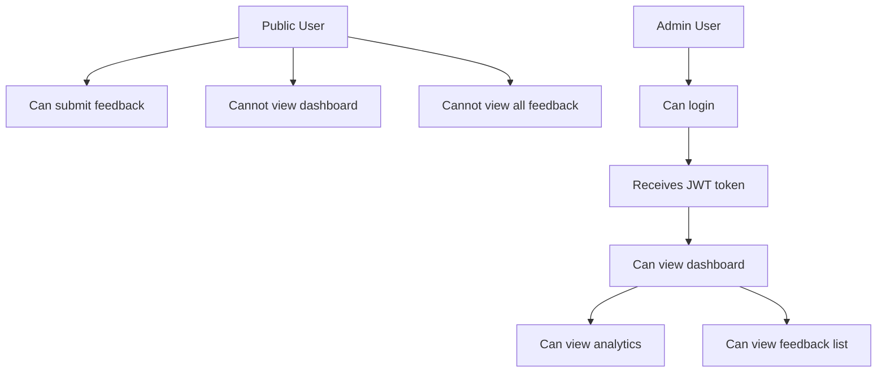
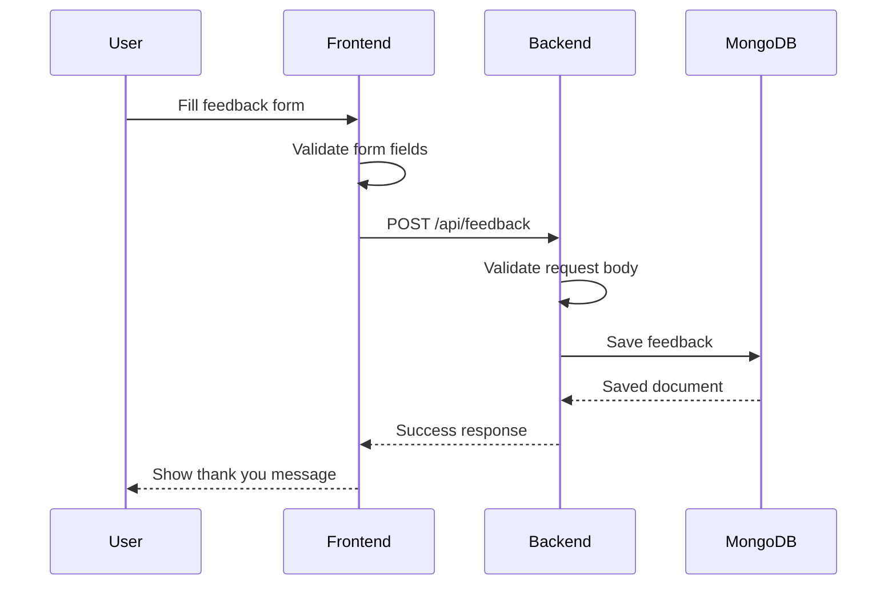
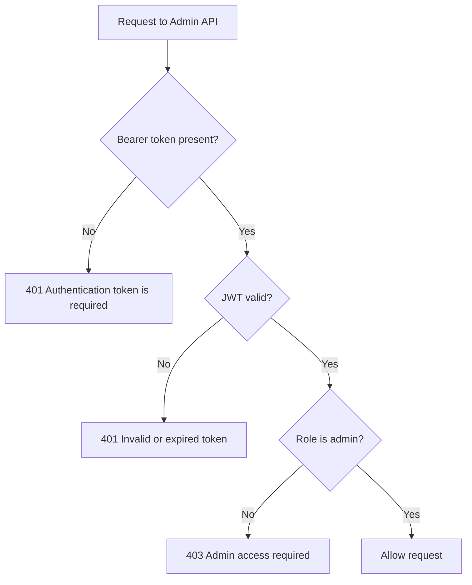
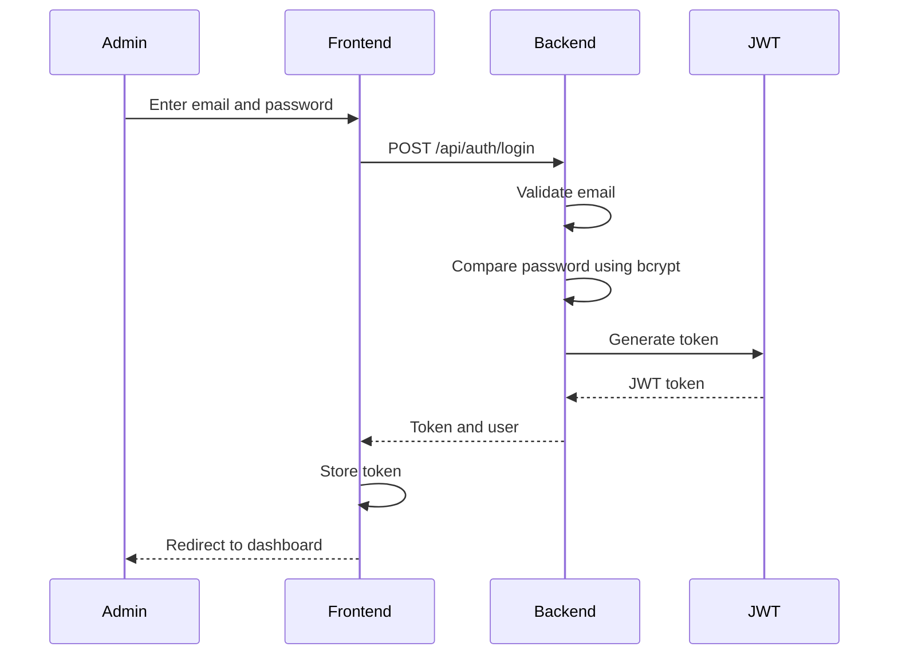
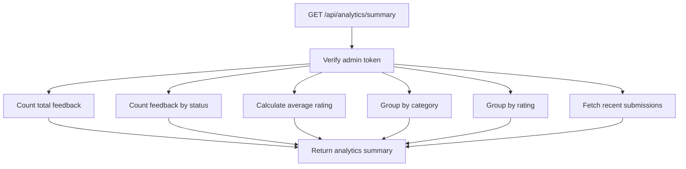
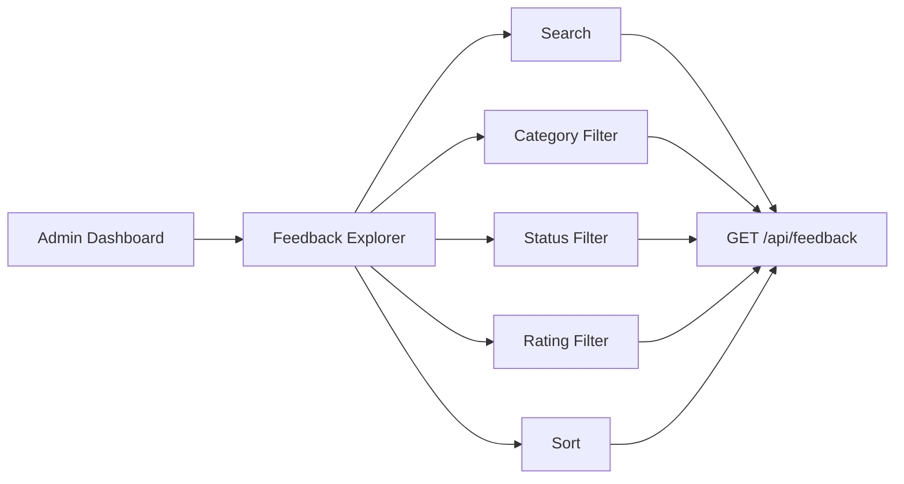
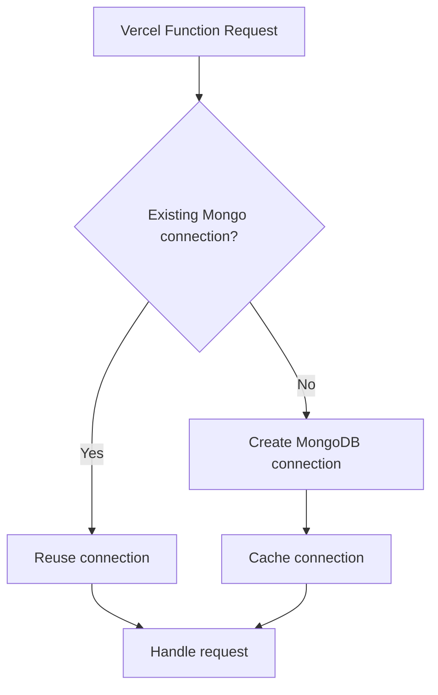
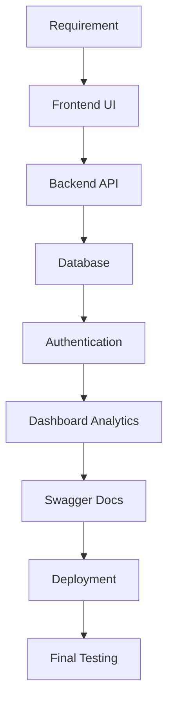

# TEACH_US.md

## Topic: Building a Public Feedback Flow with a Protected Admin Dashboard

This project looks simple from the outside: users submit feedback and admins view it.
But the interesting engineering challenge is designing two different access patterns in the same system.

---

## 1. Two Different Users, Two Different Permissions

The platform has two user types:

```txt
Public User
Admin User
```

They use the same product, but they should not have the same access.



This is the most important product and security boundary in the project.

---

## 2. Public Feedback Submission

The feedback form is public because users should be able to submit feedback easily.

A user can submit:

* Name
* Email
* Category
* Rating
* Comment

The public endpoint is:

```txt
POST /api/feedback
```

It does not require authentication.

### Flow



### Why public?

If feedback submission required login, fewer users would submit feedback.
So the endpoint is public, but it is still protected using:

* Backend validation
* Mongoose schema
* Rate limiting

---

## 3. Admin Dashboard Protection

Admin data is sensitive because it may contain:

* User names
* User emails
* Feedback comments
* Ratings
* Metadata
* Analytics

So the admin dashboard is protected on both frontend and backend.

Protected backend routes:

```txt
GET /api/feedback
GET /api/analytics/summary
POST /api/auth/logout
```

---

## 4. Why Frontend Protection Alone Is Not Enough

A frontend protected route prevents normal users from clicking into the dashboard.

But someone can still directly call APIs using:

* Browser
* Postman
* curl
* PowerShell
* Any HTTP client

So backend protection is required.



This ensures security is enforced at the API level.

---

## 5. JWT Login Flow

When an admin logs in, the backend verifies credentials and returns a JWT token.



The frontend sends the token in protected requests:

```txt
Authorization: Bearer <token>
```

---

## 6. Analytics Design

The analytics API prepares dashboard-ready data.

Endpoint:

```txt
GET /api/analytics/summary
```

It returns:

* Total feedback
* New feedback
* In review feedback
* Resolved feedback
* Archived feedback
* Average rating
* Category distribution
* Rating distribution
* Recent submissions
* Trends



This keeps the frontend simple because the backend sends ready-to-render dashboard data.

---

## 7. Feedback Explorer Design

The admin dashboard includes a feedback explorer table.

It supports:

* Search
* Category filter
* Status filter
* Rating filter
* Sorting



This helps admins move from high-level analytics to individual feedback records.

---

## 8. Serverless Deployment Learning

Both frontend and backend were deployed on Vercel.

Frontend deployment was straightforward because Vite produces static files.

Backend deployment needed extra work because Express normally runs as a long-running server, while Vercel runs backend functions as serverless functions.

### Problem

Local backend uses:

```txt
src/server.js
```

Vercel needs:

```txt
api/index.js
```

### Solution

A serverless entry file was created:

```txt
backend/api/index.js
```

It connects to MongoDB and then passes the request to the Express app.

---

## 9. MongoDB Connection Learning

In a normal server, MongoDB connects once when the app starts.

In serverless, functions can start and stop repeatedly.
If every request creates a new connection, the app can become slow or timeout.

So connection caching was added.



This made feedback creation and dashboard loading stable.

---

## 10. Swagger Deployment Learning

Swagger worked locally but initially had issues on Vercel because static Swagger UI assets were not served correctly.

The final solution was:

* Serve Swagger JSON at `/api/docs.json`
* Serve custom Swagger HTML at `/api/docs`
* Load Swagger UI assets from CDN

This made API documentation work reliably in production.

---

## 11. Main Engineering Learning

The biggest learning was that a real full-stack feature is not only about building UI and APIs.

A complete production-ready flow also needs:

* Validation
* Authentication
* Authorization
* Error handling
* Rate limiting
* Database persistence
* Deployment configuration
* CORS
* API documentation
* Serverless database connection handling

The final flow is:

```txt
Public Feedback → Backend Validation → MongoDB Storage → Admin Auth → Protected Analytics Dashboard
```

---

## 12. Final Takeaway

This project demonstrates the full lifecycle of a feature:



The most important part is not just that feedback can be submitted, but that the complete system is secure, documented, deployed, and testable.
